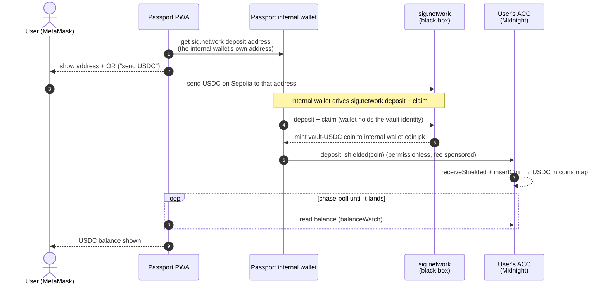

# Bridging USDC from Ethereum into a Passport account (sig.network)

Design note. Status: draft for review. Against `passport-demo@main` (v10), the
`sig.network` repos, and `passport` PR #150 (cross-contract calls). 2026-09-10.

## TL;DR

- **Goal:** USDC a user holds on Ethereum Sepolia shows up as a spendable balance
  inside their Account Custody Contract (ACC) on Midnight stagenet.
- **What sig.network gives us:** a **shielded custom token on Midnight** ("vault-USDC")
  whose colour is fixed per (USDC address, vault contract). We treat sig.network as a
  black box: we hand it a deposit, it mints us that shielded coin.
- **How it lands in the ACC:** the **Passport internal wallet** runs the sig.network claim
  so the coin arrives in a regular Midnight wallet, then calls the ACC's permissionless
  `deposit_shielded` to register that coin in the user's account. Two Midnight transactions.
- **Why a wallet in the middle:** the claim mints to a coin public key. Minting straight to
  the ACC's contract address does not work — a bare mint to a contract address is rejected
  by the ledger unless a claim circuit registers it in the same transaction, and the ACC
  only sees a shielded coin when its own `deposit_shielded` circuit runs. Contract-to-
  contract (C2C) calls cannot close this gap today either — see
  [§ Why C2C cannot avoid the wallet](#why-c2c-cannot-avoid-the-wallet-today).
- **Enabling fact:** the sig.network vault and Passport ACCs are on the **same stagenet**
  and the **same ledger-9 / midnight-js-5 stack**, so the hand-off is a plain on-chain
  transaction, not a second bridge.

## Diagram



Everything left of the wallet is the user's own Ethereum action. From the claim onward the
Passport internal wallet acts as the intermediary, then hands the coin to the ACC exactly as
`passport-balancer` already does for the mUSD activation grant (mint → `deposit_shielded`).

## Why C2C cannot avoid the wallet (today)

Checked against `passport/experiments/cross-contract-calls` (PR #150, merged), which
validated Compact C2C end to end on the ledger-9 stable stack. The ACC already works as a
C2C **callee** (probe P5) and shielded value already crosses a call boundary (probe P7). So
the natural question is whether one atomic transaction could mint the bridged USDC straight
into the ACC with no intermediary wallet. It cannot, for two decisive reasons plus a third
that blocks the related "ACC as caller" idea.

1. **The claim is witness-consuming, so it can only be a transaction root — never a
   sub-call.** sig.network's `completeDeposit` reads the vault identity secret through a
   witness (`callerSecretKey()`, `erc20-vault.compact:468`). PR #150 establishes that on the
   released runtime a **callee must be witness-free**; only a transaction's root circuit may
   consume witnesses (FINDINGS #9, #10). So no Passport-side circuit — not the ACC, not an
   adapter contract — can invoke the claim inside its own call tree. The claim has to be the
   root of its own transaction, driven by whoever holds the witness: a wallet.

2. **Landing the coin in the ACC atomically would require editing the sig.network vault,
   which we do not control.** Value addressed to a contract is not credited on its own — the
   ledger rejects a transaction whose contract-addressed output no recipient circuit claims
   in the same transaction (FINDINGS #4, #8). So for the mint to reach the ACC in one
   transaction, the claim (as root) would have to drive the ACC's `deposit_shielded` as a
   same-transaction sub-call. That is a change to the vault's `completeDeposit`: adding the
   cross-contract call and a compile-time dependency on the ACC's ABI. The vault is deployed
   and pinned (its MPC response key and addresses are sealed at `initialise`); we cannot edit
   it without redeploying the whole sig.network bridge.

3. **A callee cannot identify its caller.** `kernel.caller()` is upstream-branch-only; on
   every released line no contract can grant authority because a specific contract called it
   (FINDINGS #2). This is the same limitation as the ACC's own auth model — authority travels
   in arguments, not caller identity. So any scheme where the claim "trusts the ACC because
   the ACC called it" is unimplementable regardless. This is the exact point raised on PR #150.

**Consequence.** Today the flow is necessarily two transactions: the claim runs from a wallet
that holds the vault identity (minting vault-USDC to that wallet), then a second transaction
calls the ACC's permissionless `deposit_shielded` to register the coin.

**Productisation seam.** C2C makes a cleaner future possible: the ACC's `deposit_shielded` is
already **witness-free**, so it can serve as the exported claim circuit that a sig.network
claim-root drives in one atomic transaction (the P7 send-plus-same-transaction-claim pattern,
with Passport as the P5-proven callee). That is a coordinated sig.network-side contract
change, not something Passport can do alone. Until it lands, the internal wallet is required.

## The intermediary: Passport's internal wallet

The wallet doing the claim is the Passport PWA's **internal wallet** — a transparent Midnight
wallet the PWA already uses for internal operations. sig.network's deposit identity is simply
this wallet: the Sepolia deposit address the user funds is the address sig.network derives for
the internal wallet, and the claim's `callerSecretKey` is the internal wallet's own secret.
There is no separate vault identity to derive or custody. `deposit_shielded` is permissionless
(no `require_device`), so the hand-off into the ACC needs no extra authority.

`passport-balancer` is the precedent for the shape: it already does mint → `deposit_shielded`
into user ACCs to hand out mUSD (`examples/passport-balancer/src/account.ts:1083,1385`). Here
the mint is replaced by a sig.network claim, and the wallet is Passport's internal wallet
rather than the sponsor's.

## What Passport needs to build

**Client (PWA), all additive:**

- **Deposit address:** an "add funds → from Ethereum" screen showing the internal wallet's
  sig.network Sepolia address (address + QR) and progress. Passport can build the user's
  funding transfer (an EIP-681 request / deep-link for `transfer(depositAddress, amount)` on
  the USDC contract) for the user to authorize in their own Ethereum wallet — see below.
- **Drive the sig.network deposit + claim** from the internal wallet. sig.network's MPC and
  relayer are already deployed on stagenet, so Passport only drives the client; the relayer
  broadcasts the Sepolia transfer and covers its gas. All proving goes to a remote proof
  server, not the browser.
- **Deposit leg:** call the ACC `deposit_shielded` with the claimed coin, fee-sponsored via
  the balancer's existing `/balance-only` path, with the ACC guard
  (`device_count >= 1 && recovery_shares.size() === 3`) before depositing.
- **One `KNOWN_COLOURS` entry** for the USDC colour in
  `examples/passport-demo/src/lib/colour.ts:170` —
  `{ symbol: 'USDC', name: 'stablecoin', decimals: 0, mark: USD_MARK }`. Every screen reads
  that one table.
- **Reuse `assetsOnTheWay.ts` + `balanceWatch.ts`** to show USDC "On the way" and chase-poll
  the ACC until it lands.

**The two Ethereum movements.** (1) The user sends USDC from their own Ethereum wallet to the
deposit address — Passport cannot sign this, but can present a ready-to-authorize transfer.
(2) The deposit address → vault transfer is MPC-signed and broadcast by sig.network's deployed
relayer — nothing for Passport to build. So the user's only manual step is (1).

The connector protocol (`packages/connect`) does **not** change — bridge-in is an internal
PWA flow, not a partner-app intent.

## The ACC deposit circuit (the one contract fact that matters)

`contracts/account.compact:246` — permissionless, **witness-free**:

```compact
export circuit deposit_shielded(coin: ShieldedCoinInfo): [] {
  receiveShielded(disclose(coin));
  const c = disclose(coin.color);
  if (coins.member(c)) {
    const merged = mergeCoinImmediate(coins.lookup(c), disclose(coin));
    coins.insertCoin(c, disclose(merged), right<ZswapCoinPublicKey, ContractAddress>(kernel.self()));
  } else {
    coins.insertCoin(c, disclose(coin), right<ZswapCoinPublicKey, ContractAddress>(kernel.self()));
  }
}
```

The internal wallet spends its just-claimed vault-USDC coin as the balancing input; the
circuit runs `receiveShielded` + `insertCoin` and the ACC holds the coin. Being witness-free
is also what makes this circuit the productisation seam above.

## Implementation order

1. **Claim path spike:** using the internal wallet's sig.network deposit address, run
   sig.network deposit + claim to the internal wallet end to end for one test user (proving on
   the remote proof server).
2. **ACC hand-off:** add the `deposit_shielded` leg (reuse the balancer deposit engine) with
   the ACC guard and `/balance-only` fee sponsorship.
3. **PWA surface:** "from Ethereum" screen + QR, `USDC` in `KNOWN_COLOURS`, `assetsOnTheWay` /
   `balanceWatch` wiring.

See [the implementation plan](./sig-network-implementation-plan.md) for the phased build.

## Source references

- ACC deposit circuits: `contracts/account.compact:208-263`; mirror blind spot `:120-123`.
- Balancer mint→deposit precedent: `examples/passport-balancer/src/account.ts:1083,1385`.
- Colour table: `examples/passport-demo/src/lib/colour.ts:170`.
- "On the way" UI: `examples/passport-demo/src/screens/assetsOnTheWay.ts`,
  `src/lib/balanceWatch.ts`.
- sig.network claim/mint: `midnight-examples/examples/erc20-vault/contract/src/erc20-vault.compact:438`
  (witness `callerSecretKey` at `:152,468`).
- C2C evidence: `passport/experiments/cross-contract-calls/FINDINGS.md` (PR #150) — P5 account
  callee, P7 shielded value, findings #2 (no `kernel.caller()`), #4/#8 (send+claim), #9/#10
  (callees witness-free).
- Same-stagenet endpoints: `examples/passport-demo/src/lib/localWallet.ts:212-213`
  vs `full-stack-demo/.env.example:6-8`.
