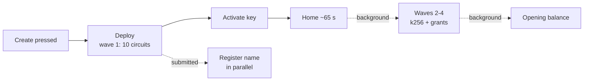

# Passport setup: from 4 minutes to 1

2026/09/22 · Utkarsh Varma

## Summary

A new Passport now reaches Home in about **65 seconds**, down from about **250 seconds**, with no change to the account custody contract. The on-chain work is the same; the app no longer makes the person wait for the parts they do not need yet.

| Milestone (seconds after pressing Create) | Before | After |
| --- | --- | --- |
| Home shown | 251 | 65 |
| `.night` name registered | 248 | 67 |
| All 30 circuits installed | 81 | 131 (in the background) |
| Opening balance visible | 199 | about 180 (in the background) |

Measured live on stagenet on 2026/09/22: "before" is the old order on build 83880d94; "after" is a clean run on build 34febf9a (a second run took 114 s because its first activation attempt was retried). One trade-off: for about the first minute after Home, a new Passport can send but cannot yet be paid.

## Why setup took about 4 minutes

Nothing on chain is slow: setup was nine transactions run strictly one after another, each costing 20 to 25 seconds (about 6 s to be included in a block, then the wait for the indexer to report it). Proving is only 8.6 of the 251 seconds.

The old prototype contract needed about four steps because a single deploy carried every circuit. The account custody contract's 30 verifier keys total 74,286 bytes against a 25,000-byte transaction budget, so a passkey account needs a deploy plus three more "waves", then a separate activation.

| From (s) | To (s) | Phase | Waiting on |
| --- | --- | --- | --- |
| 0 | 14 | Passkey, local wallet, contract and keys loaded | the browser |
| 14 | 81 | Deploy (wave 1, 10 circuits), then waves 2, 3 and 4 | block + indexer, one after another |
| 81 | 140 | Activation built, proved on the droplet (8.6 s), balanced, landed | block + indexer |
| 140 | 199 | Opening balance: NIGHT and mUSD deposited at once; the mUSD deposit is refused every time (node error 104) and retried | a collision, then a retry |
| 201 | 223 | A resolver deployed for the name, because the pre-deployed pool is off | block + indexer |
| 223 | 248 | Name registered | block + indexer |
| 251 | | Home | |

Timeline of account 6f00a356… on 2026/09/22, from the sponsor's journal and the page console; two other setups that evening matched within a few seconds.

## What we changed (app only, no contract change)

Home now waits only for what a person needs to use the Passport; everything else runs behind it.

Solid arrows are what Home waits for; dotted ones run alongside or after it.

| Change | Why it is safe | Saving |
| --- | --- | --- |
| Activate right after the deploy; finish waves 2-4 in the background | Wave 1 already holds every circuit a passkey Passport calls (both deposits and the 8 jubjub circuits, including sends); the later waves carry only the k256 and grant circuits | about 70 s |
| Start the name claim when the deploy is submitted | The name only needs the account's address; the sponsor accepts a pending target | about 50 s |
| Do not wait for the opening balance | Home shows the balance when it lands | about 60 s |
| Load the wallet, contract module and keys while the person types a name | Pure preloading | 5-10 s |

The background waves take the same per-account lock as sends, one wave at a time, so a send waits at most one wave (about 25 s) and the two can never collide on chain. A saved record can no longer lower the waves-done count, so a send finishing mid-wave cannot undo setup progress. Each phase logs `[setup-timing] <phase> <ms>` in the page console for measurement.

## Send reliability fixes shipped with it

mUSD sends that hung on "Sending…" and balances stuck at 0 after a reload had one main cause: a leaked network connection per call.

| Symptom | Root cause | Fix |
| --- | --- | --- |
| Send stuck before any proof was requested | Every read, refresh and payment opened a new wallet connection and never closed it; after about 15 minutes Chrome refused new sockets ("Insufficient resources") | One wallet connection per user for the tab |
| Send submitted but never on chain | Two transactions on the same account in one block are refused by the node (error 104), e.g. a send racing the previous send's inbox backfill | One custody transaction per account at a time, across tabs; a 104 is rebuilt and resubmitted up to twice |
| "Sending…" forever | Several waits had no bound (pre-proving reads, the inbox backfill waiting for finality) | Every phase bounded; after 3 minutes the sheet says "That payment didn't go through. Nothing left your Passport." and Send works again |
| mUSD shows 0 "Arriving" after a reload | The spend was recorded only after the node answered, and nothing compared the local coin store with the chain | The spend is recorded when balanced; every load reconciles pending and taken-back spends against the chain |

Live on stagenet (2026/09/22): simultaneous sends in both directions both landed; a submission the node never saw was answered within the bound, including across a reload; a reload while proving left the balance intact and the next send landed. Also shipped: mUSD is the default asset, NIGHT can be sent to an `mn_addr` address, and a name on an older Passport is refused before any approval with a sentence saying it is on the older version.

## Trade-offs and what still needs proving

The main cost is a short window after Home in which a new Passport cannot be paid.

- **Receiving waits for the background waves (about 70 s after Home).** The sponsor and other senders open the account against all 30 circuits, so a gift or payment into a brand-new account is refused until the last wave lands. Sends out of it work.
- **The opening balance appears after Home**, about 1.5 to 2.5 minutes after the press, rather than with it.
- **"Add a way back" (the recovery device) waits for the waves** carrying the k256 circuits, and is offered once they are in.
- **A tab closed mid-waves** resumes them the next time the passkey is used (a send, adding recovery), since a browser will not show a passkey prompt the person did not tap for.
- **Still to prove live:** the new order across more runs (one of two runs today retried its activation and took 114 s), a returning browser, and the Android and iPhone walks.

## Next steps

Two server changes would take a further 20-30 seconds off, and one contract change would make setup a single transaction.

| Step | Owner | Expected effect |
| --- | --- | --- |
| Turn on the pre-deployed resolver pool (environment setting; needs a sponsor restart) | Passport team, on approval | Name registered about 22 s sooner |
| Run the two opening deposits in order instead of together | Passport team (sponsor) | No 104 retry; balance 20-30 s sooner |
| Pre-deployed accounts, handed over at activation | Contract owner | Setup as one activation transaction, about 35-50 s to Home |

Questions for the contract owner (sent 2026/09/22):

1. The constructor binds `initial_device_boot` (from the owner's device key) and `encryption_key` at deploy, and nothing can change them before activation, so accounts cannot be pre-deployed. Could the account take a sponsor pool key at deploy, plus one circuit that sets the owner's device and encryption key on a sponsor signature?
2. Failing that, a one-time pre-activation "set boot" circuit?
3. Do deposits need to bump `round`? Two deposits into one account in the same block collide (error 104).
4. Is installing the remaining waves in the background after Home, or lazily on first use, acceptable, with the maintenance key live a little longer?
5. Can a deploy and the activation call share one transaction?
