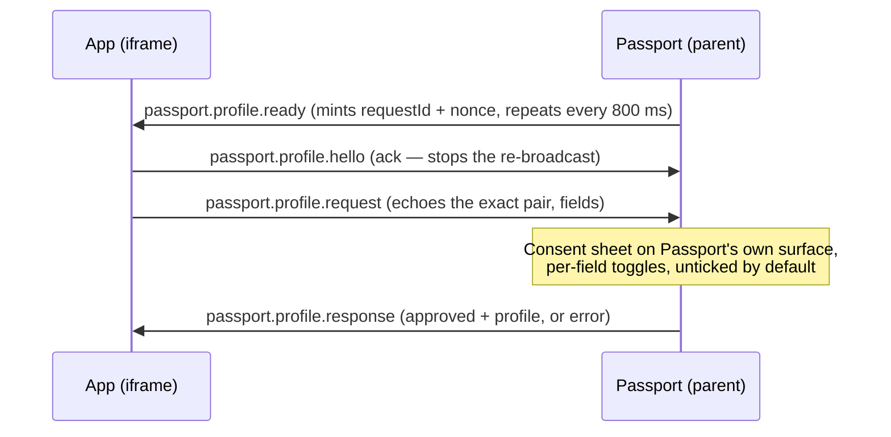
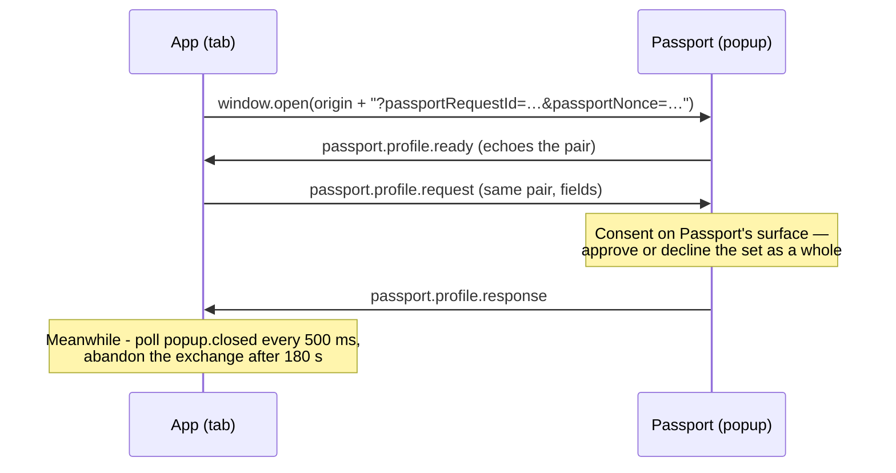
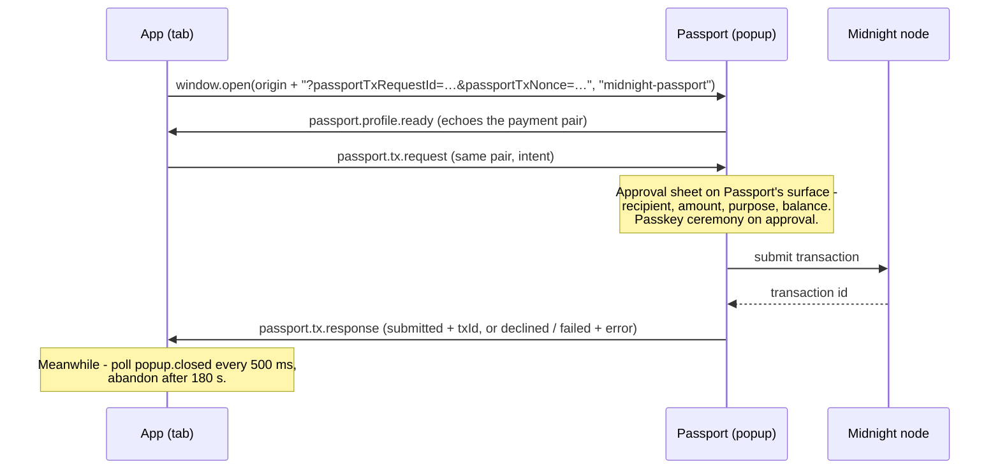
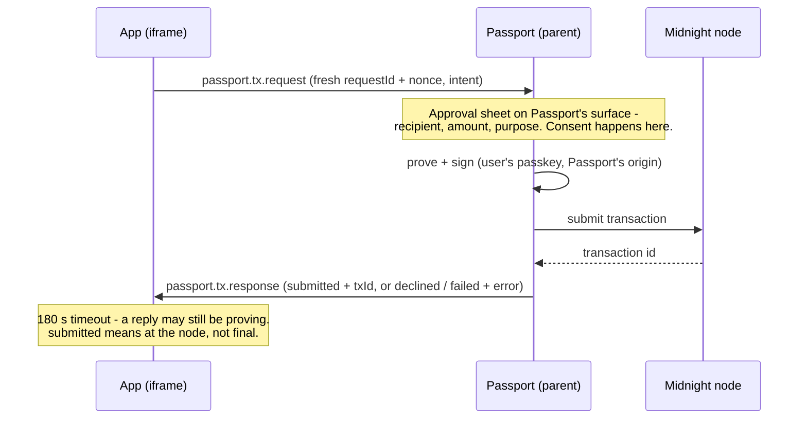

# The Passport bridge protocols

Everything in this document is derived from the two vendored protocol modules
in this template — [`src/bridge/profileProtocol.ts`](../src/bridge/profileProtocol.ts)
and [`src/bridge/txProtocol.ts`](../src/bridge/txProtocol.ts) — and from the
reference client in [`src/main.tsx`](../src/main.tsx). Those files are the
truth; if this document ever disagrees with them, the code wins.

Two protocols, both plain `postMessage` over a pinned origin:

| Protocol | Identifier | Purpose |
| --- | --- | --- |
| Profile | `org.midnight.passport.profile/v1` | Ask the user for profile fields, with per-field consent. |
| Transactions | `org.midnight.passport.tx/v1` | Ask Passport to make an unshielded NIGHT transfer. |

The identifiers are exported as `PASSPORT_PROFILE_PROTOCOL`
(`profileProtocol.ts:17`) and `PASSPORT_TX_PROTOCOL` (`txProtocol.ts:43`).

---

## Transport rules (both protocols)

1. **Origin pinning.** Every message is posted to one exact origin — never
   `'*'` — and every inbound message whose `event.origin` is not that origin
   is dropped before it is parsed. The template also checks `event.source`:
   `window.parent` in embedded mode, the opened popup in standalone mode
   (`main.tsx`, both `onMessage` handlers).
2. **Request binding.** Every reply echoes the `requestId` and `nonce` of the
   request it answers. Anything that does not match a pair the app is
   *currently* waiting on is not the answer — drop it. Nonces are unguessable
   random bytes, not counters or timestamps (`randomNonce()` in `main.tsx`).
3. **Strict parsing.** The parsers return `null` — never a partially-filled
   object, never a coerced one — for anything that is not exactly a
   well-formed message. Every string on the wire is length-capped so a hostile
   counterparty cannot push megabytes of text into the other side's interface.
4. **Unknown message types are dropped harmlessly.** That is what makes the
   embedded acknowledgement (`passport.profile.hello`) safe: it is not part of
   either protocol, and Passport's parsers simply ignore it.

### Length caps

| Cap | Value | Applies to | Source |
| --- | --- | --- | --- |
| Ids and short strings (profile) | 256 | `requestId`, `nonce`, `displayName`, `network` | `profileProtocol.ts:69` |
| Addresses (profile) | 512 | contract and Midnight addresses | `profileProtocol.ts:71` |
| Ids (tx) | 256 | `requestId`, `nonce`, `txId`, incentive `id` | `txProtocol.ts:46` |
| `purpose` | 140 | tx intent | `txProtocol.ts:47` |
| `recipientAddress` | 200 | tx intent | `txProtocol.ts:48` |
| `detail` | 400 | tx response | `txProtocol.ts:49` |
| Incentive `label` | 80 | incentive report | `txProtocol.ts:50` |
| `feeNote` | 140 | tx response | `txProtocol.ts:51` |

All bounded strings must also be non-empty (`isBoundedString` in both
modules).

---

## Profile — `org.midnight.passport.profile/v1`

Three message types. Who mints the `requestId`/`nonce` pair depends on the
mounting mode; the shapes do not.

### `passport.profile.ready` — Passport → app

```json
{
  "protocol": "org.midnight.passport.profile/v1",
  "type": "passport.profile.ready",
  "requestId": "9f4c2f6a-6f0e-4d0f-9b1e-2a7c8f0d3b41",
  "nonce": "b1946ac92492d2347c6235b4d2611184c0e1a2b3"
}
```

Validation (`parsePassportProfileReady`, `profileProtocol.ts:114`): exact
`protocol` and `type`, and `requestId` and `nonce` as non-empty strings of at
most 256 characters. Anything else parses to `null`.

Mode difference:

- **Embedded:** Passport mints the pair and posts `ready` down to the frame
  unprompted, then **re-broadcasts the same pair every 800 ms** until the
  frame sends any message back, capped at 40 attempts (about 32 s) so an app
  that never speaks the protocol is not pestered forever. `ready` is
  therefore idempotent and can arrive late, mid-flow — never let a repeat
  reset state (`main.tsx`, Act 1 embedded).
- **Standalone:** the app mints the pair, hands it to Passport on the popup
  URL, and Passport echoes it back in `ready` — the signal that the window is
  listening (`main.tsx`, Act 1 standalone).

`ready` is also what the **payment** popup announces itself with; it is not
profile-specific in practice, it just means *this Passport window is live, and
here is your pair back*. The pair, never the message type, is what tells an app
which exchange is being answered. Match on it — see
[the popup launch contract](#the-popup-launch-contract) below.

### `passport.profile.request` — app → Passport

```json
{
  "protocol": "org.midnight.passport.profile/v1",
  "type": "passport.profile.request",
  "requestId": "9f4c2f6a-6f0e-4d0f-9b1e-2a7c8f0d3b41",
  "nonce": "b1946ac92492d2347c6235b4d2611184c0e1a2b3",
  "fields": ["displayName", "passportContract"]
}
```

Validation (`parsePassportProfileRequest`, `profileProtocol.ts:92`):

- `requestId` and `nonce` — non-empty, ≤ 256 characters. In embedded mode,
  echo the exact pair from `ready`: Passport binds its reply to whatever pair
  the request carried, and does accept a self-minted pair, but only the
  echoed pair is recognised as bound to the handshake it issued. This
  template always echoes.
- `fields` — a non-empty array drawn from `PASSPORT_PROFILE_FIELDS`
  (`profileProtocol.ts:19`): `displayName` and `passportContract`. Those two
  are the whole vocabulary — the engine's own unshielded, shielded, and dust
  addresses are not offerable, because a user's identity is their
  account-custody contract and money belongs at the account, not at whatever
  address the wallet happens to sign from. Duplicates and unknown field names
  reject the **whole request**, and the rejection is answered with
  `invalid_request` rather than dropped.

### `passport.profile.response` — Passport → app

Approved:

```json
{
  "protocol": "org.midnight.passport.profile/v1",
  "type": "passport.profile.response",
  "requestId": "9f4c2f6a-6f0e-4d0f-9b1e-2a7c8f0d3b41",
  "nonce": "b1946ac92492d2347c6235b4d2611184c0e1a2b3",
  "approved": true,
  "profile": {
    "displayName": "alice.midnight",
    "passportContract": {
      "address": "mn_shield-addr_preview1…",
      "network": "preview"
    }
  }
}
```

Refused:

```json
{
  "protocol": "org.midnight.passport.profile/v1",
  "type": "passport.profile.response",
  "requestId": "9f4c2f6a-6f0e-4d0f-9b1e-2a7c8f0d3b41",
  "nonce": "b1946ac92492d2347c6235b4d2611184c0e1a2b3",
  "approved": false,
  "error": "denied"
}
```

Validation (`parsePassportProfileResponse`, `profileProtocol.ts:186`):

- `approved` must be a real boolean.
- `approved: true` requires a valid `profile` object. Only declared fields
  survive parsing, every string is capped, and a declared field that is
  present but malformed rejects the **whole profile**
  (`parsePassportProfile`, `profileProtocol.ts:140`). The parsed object is
  freshly constructed, so nothing undeclared can ride along.
- `approved: false` requires `error` to be exactly one of the codes
  below; anything else parses to `null`.

Field shapes when approved:

| Field | Shape |
| --- | --- |
| `displayName` | `string` (≤ 256) |
| `passportContract` | `{ address: string (≤ 512), network: string (≤ 256) }` |

Profile error vocabulary (`profileProtocol.ts:60`):

| Code | Meaning |
| --- | --- |
| `denied` | The user refused on Passport's consent sheet. |
| `profile_unavailable` | Passport has no profile to share yet. |
| `invalid_request` | A consent sheet was already open for this app — a second request must not replace the one the user is reading. (A request that does not parse gets **no reply at all**: Passport's strict parsers drop it before there is a valid pair to bind a reply to.) |

**Consent is per-mode.** Embedded, Passport's sheet has a toggle per requested
field, every one unticked by default — the user may approve one field of two,
so a requested field can legitimately be missing from an approved `profile`.
The standalone popup is coarser: it approves or declines the requested set as
a whole. Either way, render what arrived and say plainly what did not
(`main.tsx`, Act 2 render).

### Sequence — embedded

Passport frames the app in its in-app browser; Passport is `window.parent`.

1. The frame loads. Passport mints `{requestId, nonce}` and posts
   `passport.profile.ready`, repeating every 800 ms until the frame speaks.
2. The app stores the pair and acknowledges with a `passport.profile.hello`
   (any message stops the re-broadcast and clears Passport's "this app is not
   responding" hint).
3. When the user acts, the app posts `passport.profile.request` echoing the
   exact pair.
4. Passport shows its consent sheet on its own surface.
5. Passport posts `passport.profile.response`, bound to the same pair.



### Sequence — standalone

The app is open in an ordinary tab and opens Passport in a popup.

1. The app mints `{requestId, nonce}` and opens
   `PASSPORT_ORIGIN/?passportRequestId=…&passportNonce=…` as a popup, under the
   window name `midnight-passport` (`PASSPORT_WINDOW` in `main.tsx`).
2. Passport posts `passport.profile.ready` echoing that pair back.
3. The app posts `passport.profile.request` with the same pair and its fields.
4. Passport shows its consent surface; the user approves or declines the set
   as a whole.
5. Passport posts `passport.profile.response`.

The app also polls the popup every 500 ms for having been closed, and abandons
the exchange after 180 s — a closed or silent popup never answers, and no
message says so (`POPUP_POLL_MS`, `TX_TIMEOUT_MS` in `main.tsx`).



---

## Transactions — `org.midnight.passport.tx/v1`

**Both channels.** A framed app posts the intent to `window.parent`; a
standalone app posts it to a Passport popup it opened on the payment launch
contract below. The messages, the validation, the error vocabulary, and the
approval sheet's content are the same either way — Passport climbs one shared
ladder of checks before either surface will show a sheet (`main.tsx`, Act 3).

The app never builds, signs, or submits anything. It posts an **intent** —
recipient, amount, purpose — and Passport proves, signs, and submits on its
own surface, returning either the node's transaction identifier or a named
refusal. The wait is long by web standards; the template budgets 180 s
(`TX_TIMEOUT_MS`).

### The popup launch contract

Standalone only. Passport arms **exactly one** consent surface per window load,
chosen by which pair of query parameters the launch URL carries:

| Exchange | Query parameters | Surface |
| --- | --- | --- |
| Profile | `passportRequestId`, `passportNonce` | Passport's profile consent popup |
| Payment | `passportTxRequestId`, `passportTxNonce` | Passport's transaction approval popup |

Distinct names are the point: one window serves one exchange, and a payment
launch can never also arm the profile surface (or the reverse) on the same
load. Both values are the pair the **app** minted for that exchange — fresh
per payment, never the profile handshake's pair.

The exchange then runs:

1. The app opens
   `PASSPORT_ORIGIN/?passportTxRequestId=…&passportTxNonce=…` under the window
   name `midnight-passport`. Reusing that one name **navigates the Passport
   window the user already connected with** rather than stacking a second one
   beside it; Passport restores its session across the navigation with no
   further ceremony. `window.open` returning `null` is a blocked popup: no
   window, no approval, no payment — say so and stop (`requestPayment()` in
   `main.tsx`).
2. Passport echoes the pair back in `passport.profile.ready`, posted to `'*'`
   — the popup does not learn the opener's origin until a message arrives from
   it, and the message carries nothing the opener did not send. Every reply
   after that goes to the exact origin the request came from.
3. The app posts `passport.tx.request` with that same pair.
4. Passport accepts it only from `window.opener` and only when both
   `requestId` and `nonce` equal its own launch pair; anything else is dropped
   **without a reply**. A re-send of the same pair is the same request, not a
   second sheet, and is ignored rather than refused.
5. Passport shows the approval sheet — recipient, amount in display NIGHT and
   in atomic units, purpose, the wallet's own NIGHT balance, and the sentence
   saying whose key signs and what the app will receive. The passkey ceremony
   runs on approval, once.
6. Passport posts `passport.tx.response`, bound to the same pair.

If no wallet that can sign has appeared **five seconds after a Passport
session is open**, the popup answers `wallet-unavailable` rather than leaving
the app waiting. Before a session is open it waits indefinitely: the user may
still be mid-sign-in, and that takes as long as it takes.

Meanwhile the app polls `popup.closed` every 500 ms (`POPUP_POLL_MS`) and
abandons the exchange after 180 s (`TX_TIMEOUT_MS`). A closed or silent popup
never answers, and no message says so.



### `passport.tx.request` — app → Passport

```json
{
  "protocol": "org.midnight.passport.tx/v1",
  "type": "passport.tx.request",
  "requestId": "c7a8f14d-3f2b-4b6e-8f0a-92d5e1c47a10",
  "nonce": "4f6a2c81d9e07b3512aa90cdfe61b84427c05a9e",
  "intent": {
    "kind": "unshielded-transfer",
    "recipientAddress": "mn_addr_preview1…",
    "amount": "100000",
    "purpose": "Template demo payment"
  }
}
```

Validation (`parsePassportTxRequest`, `txProtocol.ts:151`):

| Field | Rule |
| --- | --- |
| `requestId`, `nonce` | Non-empty, ≤ 256. A **fresh pair per payment**, never the handshake pair — a payment reply must not be mistakable for a profile answer (`main.tsx`, `txExchange`). |
| `intent.kind` | Exactly `'unshielded-transfer'` — the only kind today. |
| `intent.recipientAddress` | Non-empty, ≤ 200. Address *validity* is deliberately not checked here — the bridge carries no Midnight SDK. Passport decodes it against its own live wallet network before showing an approval sheet (`txProtocol.ts:30–34`). |
| `intent.amount` | Atomic NIGHT as a base-10 string matching `/^[0-9]{1,20}$/` — no sign, no exponent, no decimal point — and not zero in any padded form (`txProtocol.ts:54, 169–172`). A string on purpose: a JSON number cannot carry atomic units without precision loss. 1 NIGHT = 1 000 000 atomic units (`NIGHT_DECIMALS` in `main.tsx`). |
| `intent.purpose` | Non-empty, ≤ 140. Shown to the user on Passport's approval sheet. |

### `passport.tx.response` — Passport → app

Submitted:

```json
{
  "protocol": "org.midnight.passport.tx/v1",
  "type": "passport.tx.response",
  "requestId": "c7a8f14d-3f2b-4b6e-8f0a-92d5e1c47a10",
  "nonce": "4f6a2c81d9e07b3512aa90cdfe61b84427c05a9e",
  "status": "submitted",
  "txId": "0000000000000000000000000000000000000000000000000000000000000000",
  "sponsored": true,
  "feeNote": "Network fee covered by the demo sponsor."
}
```

Failed:

```json
{
  "protocol": "org.midnight.passport.tx/v1",
  "type": "passport.tx.response",
  "requestId": "c7a8f14d-3f2b-4b6e-8f0a-92d5e1c47a10",
  "nonce": "4f6a2c81d9e07b3512aa90cdfe61b84427c05a9e",
  "status": "failed",
  "error": "insufficient-funds",
  "detail": "The wallet's own sentence about what stopped it."
}
```

Validation (`parsePassportTxResponse`, `txProtocol.ts:223`):

| Status | Guarantee |
| --- | --- |
| `submitted` | Always carries a real `txId` (non-empty, ≤ 256) from the node. A `submitted` without one parses to `null`. |
| `declined` | The user said no. Nothing was signed. Carries an `error` code. |
| `failed` | Carries an `error` code naming what stopped it. |

Error vocabulary (`PASSPORT_TX_ERROR_CODES`, `txProtocol.ts:82`):

| Code | Meaning |
| --- | --- |
| `declined` | Refused on the approval sheet. |
| `insufficient-funds` | The wallet cannot cover it — short of NIGHT, or of the DUST that pays the network fee. |
| `wallet-unavailable` | No Passport wallet that can sign is open — no session at all, or a session signed in without the local passkey wallet (the `detail` sentence says which). |
| `invalid-request` | A sheet was already open, or the recipient is not a valid unshielded address. (A request that does not parse gets **no reply at all** — the strict parsers drop it, and the app's own timeout is what fires.) |
| `network-mismatch` | The recipient address belongs to a different network from the Passport wallet. |
| `submit-failed` | Signed, but the node rejected it or was unreachable. |

Optional fields:

- `detail` (≤ 400) — the wallet's own sentence about what happened. Worth
  showing to the user verbatim alongside your mapped copy.
- `sponsored` — may appear **only** on a `submitted` reply, must be a real
  boolean (a truthy string rejects the whole reply, `txProtocol.ts:247`), and
  `true` only when the submitted transaction genuinely came back from a fee
  sponsor with its fee input attached. **Absent means "not stated", which an
  app must read as an ordinary, user-paid transaction** (`txProtocol.ts:100–110`).
  Render "network fee covered" for `true` and for nothing else.
- `feeNote` (≤ 140) — a human-readable note about the fee, e.g. who covered
  it.

### `passport.incentive.report` — app → Passport

The one message with no reply, and the one message that is still **embedded
only**: it is recorded by the Passport frame hosting the app, and the popup
approval surface does not listen for it. A standalone app has no parent to
post it to and should not send it. It tells Passport what the app granted the
user so Passport can show it; Passport records exactly what is reported and
never invents one on an app's behalf (`parsePassportIncentiveReport`,
`txProtocol.ts:275`).

```json
{
  "protocol": "org.midnight.passport.tx/v1",
  "type": "passport.incentive.report",
  "requestId": "c7a8f14d-3f2b-4b6e-8f0a-92d5e1c47a10",
  "nonce": "4f6a2c81d9e07b3512aa90cdfe61b84427c05a9e",
  "incentive": {
    "id": "raffle-ticket-2026-08",
    "label": "Raffle ticket",
    "txId": "0000000000000000000000000000000000000000000000000000000000000000"
  }
}
```

Validation: `incentive.id` non-empty ≤ 256, `incentive.label` non-empty ≤ 80,
`incentive.txId` optional but, when present, non-empty ≤ 256. This template
does not send it; the raffle demo does.

### Sequence — payment (embedded)

The standalone equivalent is under
[the popup launch contract](#the-popup-launch-contract) above.



---

## What is *not* in the protocols

- No provider object is injected into the frame — the same-origin policy
  forbids it, and Passport does not weaken that boundary. `postMessage` is the
  only channel.
- No keys, seeds, passkeys, or signatures ever cross the bridge, in either
  direction, in any mode.
- No "remember this app", no pre-requestable scope, no way to re-ask more
  insistently.
- No contract calls, shielded transfers, or batching — `unshielded-transfer`
  is the only intent kind.
- No confirmation depth — `submitted` means *at the node*, not *final*.
